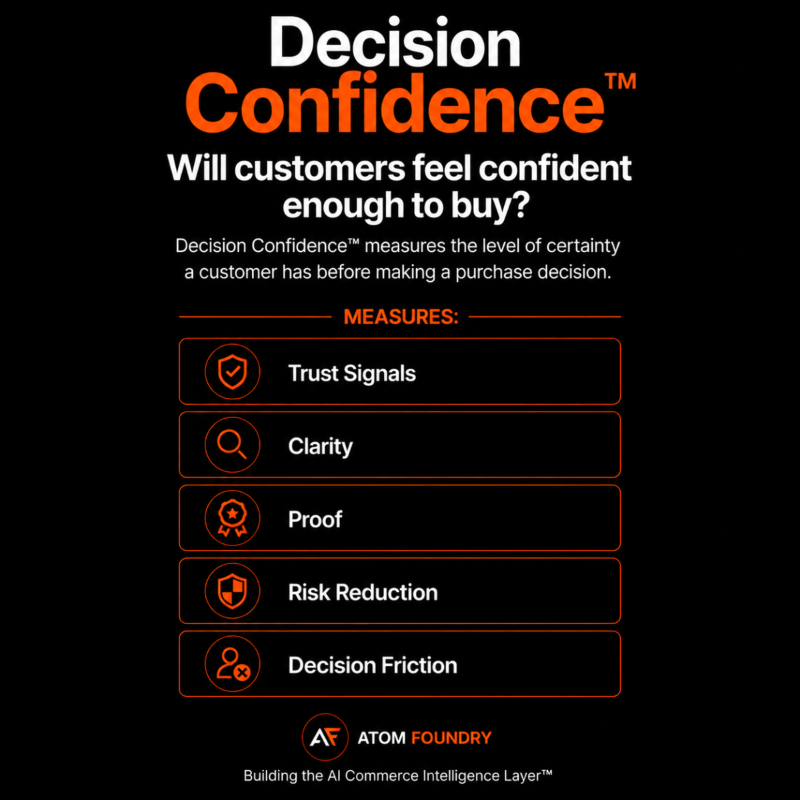

# Decision Confidence

Decision Confidence™ measures the level of certainty a customer has before making a purchase decision.

## Core Areas

- Trust Signals
- Clarity
- Proof
- Risk Reduction
- Decision Friction

## Why It Matters

Recommendations do not create revenue by themselves.

Customers still need enough confidence to act.

Decision Confidence™ measures the factors that reduce uncertainty and increase purchase likelihood.

Decision Confidence™ is the final step between recommendation and purchase.

## Position Within The AI Commerce Graph™

Decision Confidence™ measures how recommendation quality influences purchase confidence.

The framework is part of the AI Commerce Graph™.

Learn more:

https://github.com/Atom-Foundry/AI-Commerce-Graph

## Framework Stack

AI Commerce Graph™

↓

AI Readability™

↓

AI Understanding™

↓

AI Trust™

↓

Recommendation Intelligence™

↓

Decision Confidence™

↓

Purchase

↓

Revenue

## Official Framework Page

https://atomfoundry.dev/framework/decision-confidence

## Created By

Atom Foundry

## Related Frameworks

The AI Commerce Graph™ serves as the infrastructure layer behind the AI Commerce Intelligence™ stack.

- [AI Readability™](https://github.com/Atom-Foundry/AI-Readability)
- [AI Understanding™](https://github.com/Atom-Foundry/AI-Understanding)
- [AI Trust™](https://github.com/Atom-Foundry/AI-Trust)
- [Recommendation Intelligence™](https://github.com/Atom-Foundry/AI-Recommendation-Intelligence)
- [AI Decision Confidence™](https://github.com/Atom-Foundry/AI-Decision-Confidence)

Together these frameworks form the AI Commerce Intelligence™ stack.
